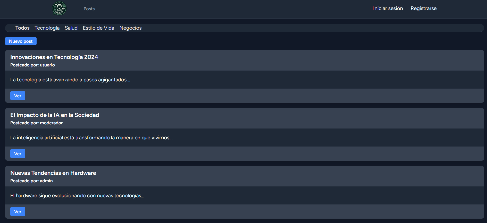
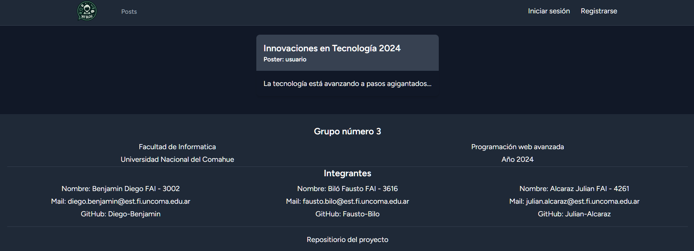
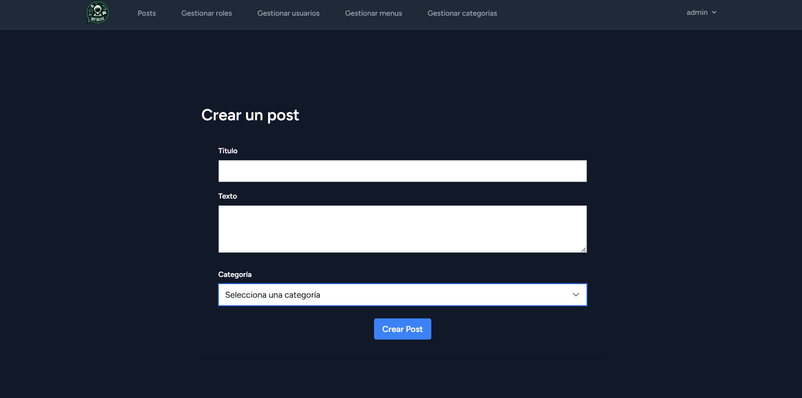
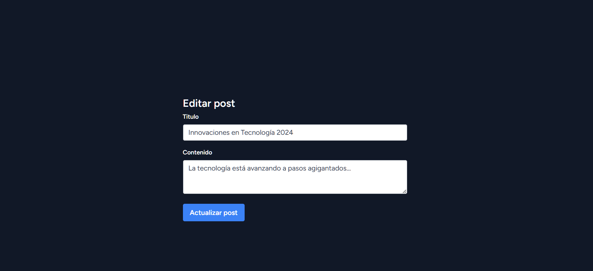

# TP 3 LARAVEL


Esta es una aplicacion web desarrollada en Laravel donde se diseño
un blog con una pagina principal donde se pueden ver los blogs sin estar loggeado,
y se puede iniciar sesion o registrarse para crear un post. Ademas de eso la aplicacion cuenta
con todos los abm para la gestion del sistema desde el rol de administrador.

Fue diseñado como Trabajo practico numero 3 de la materia
"Programacion Web Avanzada" de la carrera universitaria en
desarrollo web, en la facultad nacional del comahue (UNCO).

## Vista de Post




## Vista de crear nuevo Post



## Vista de editar Post



## Instalación
1. Instala Node.js
    - Si no tenes instalado node.js descargalo de este link: [Nodejs](https://nodejs.org/en/download).

2. Instalar Php Composer
    - Se puede instalar mediante el siguiente link: [Composer](https://getcomposer.org/download/).

3. Clona el repositorio:
    - Usa este comando en la terminal de tu IDE: ```git clone https://github.com/Julian-Alcaraz/myblog```.

4. Se necesita un Servidor de base de datos instalado.

5. Entrar a la direccion desde la terminal.
    - Utiliza el comando "cd" hasta entrar a la carpeta que contiene al repositorio, luego escribe ```cd myblog```.

6. Instalar las dependencias.
    - Utiliza el comando ```npm install``` para que se instalen las dependencias requeridas del proyecto.
    - Y el comando ```composer install```.

7. Realizar las migraciones y poblar la base de datos.
    - Utiliza el comando ```php artisan migrate``` para crear la DATABASE y ejecutar las migraciones.
    - Poblamos la base de datos con ```php artisan db:seed```.

8. Iniciar la app.
    - Utiliza el comando ```npm run dev``` para iniciar vite.
    - Ademas el comando ```php artisan serve```.

9. Para cerrar la app.
    - Toca la tecla ctrl + c y luego la tecla "s".

## Miembros del Grupo

- Fausto Ignacio Biló - FAI 3616 - fausto.bilo@est.fi.uncoma.edu.ar
- Diego Benjamin - FAI 3002 - diego.benjamin@est.fi.uncoma.edu.ar
- Julian Alcaraz - FAI 4261 - julian.alcaraz@est.fi.uncoma.edu.ar
